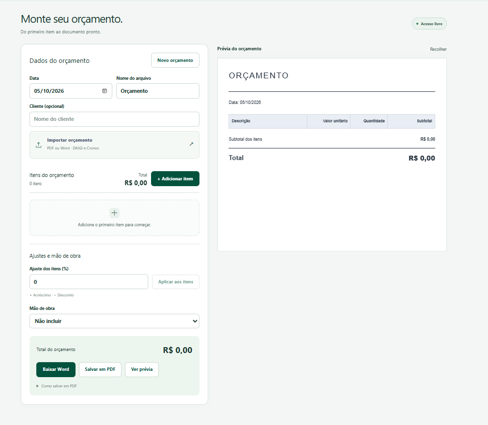
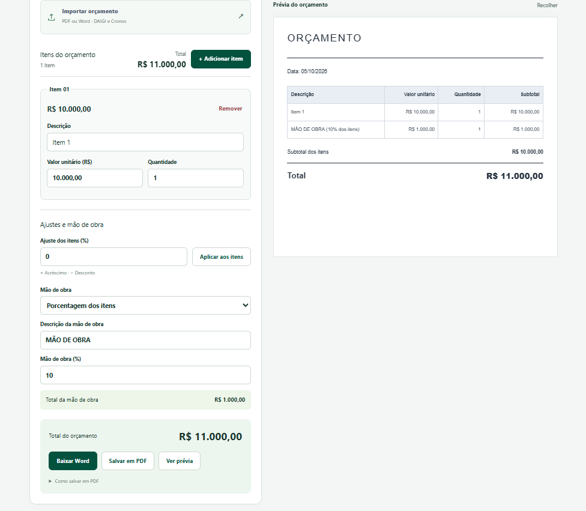
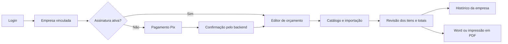

  

# DAIGI Orçamentos

**SaaS multiempresa para criar, salvar e exportar orçamentos no celular e no computador.**

Uma aplicação que reúne catálogo de materiais, cálculos, documentos com a identidade de cada empresa e assinatura por Pix em um mesmo fluxo.

[Acessar o produto](https://orcamentos.daigi.com.br) · [Ver a interface](#interface-do-projeto) · [Arquitetura](docs/ARQUITETURA.md) · [Decisões técnicas](docs/DECISOES-TECNICAS.md)

> Este repositório apresenta o projeto para portfólio. O código-fonte da aplicação é privado. O projeto inclui um editor de acesso livre; os recursos empresariais de catálogo, histórico e modelos personalizados exigem conta vinculada e assinatura ativa.

## Interface do projeto

As capturas abaixo mostram o editor de acesso livre com dados de exemplo.

### Editor e prévia do documento

Dados do orçamento, importação, itens e opções de exportação ficam ao lado da prévia do documento. A tela inicial permite começar um orçamento do zero e acompanhar sua composição durante a edição.

### Composição de valores e mão de obra

Além dos itens, o editor permite aplicar acréscimos ou descontos e incluir mão de obra por valor fixo ou percentual. No exemplo, um item de R$ 10.000,00 recebe 10% de mão de obra, resultando em um orçamento de R$ 11.000,00. A prévia apresenta os componentes e o total.

## O problema

Preparar um orçamento envolve procurar materiais, preencher quantidades e valores, conferir totais e ajustar um documento à identidade da empresa. Quando esse trabalho depende de edição manual de arquivos, repetir o processo e recuperar versões anteriores exige mais etapas.

O DAIGI organiza esse fluxo em uma interface responsiva: o usuário monta os itens, consulta o catálogo, acompanha os totais e gera o documento no modelo da sua empresa.

## Funcionalidades

| Área | O que foi implementado |
| --- | --- |
| Editor de orçamentos | Inclusão e remoção de itens, quantidades, preços unitários e cálculo de subtotais e total. |
| Ajustes e mão de obra | Acréscimos e descontos percentuais sobre os itens e mão de obra por valor fixo ou percentual. |
| Acesso livre | Editor independente com prévia e exportação de documentos, sem vínculo com uma empresa. |
| Catálogo | Pesquisa de materiais por descrição, código e referência, com sugestões adaptadas ao celular. |
| Importação | Leitura de itens de relatórios PDF do Cronos e de orçamentos PDF gerados pela aplicação. |
| Histórico | Salvamento por empresa e reabertura de orçamentos para continuar a edição. |
| Documentos | Geração de Word a partir de modelos e impressão pelo navegador, inclusive para salvar em PDF. |
| Multiempresa | Identidade, catálogo e configuração documental por empresa, com regras de acesso no banco. |
| Autenticação | Login, confirmação de e-mail e recuperação de senha com Supabase Auth. |
| Assinaturas | Geração de Pix via Mercado Pago e liberação do acesso após confirmação pelo backend. |
| Administração | Gestão de vínculos de usuários e consulta de empresas, assinaturas e pagamentos. |

## Fluxo empresarial

O editor de acesso livre apresenta o fluxo de criação e exportação de documentos. Para utilizar os recursos vinculados a uma empresa, o acesso segue as etapas abaixo.

## Tecnologias

| Camada | Tecnologias |
| --- | --- |
| Interface | React, TypeScript e Tailwind CSS |
| Build e execução web | Vite e vinext, com estrutura de rotas App Router |
| Backend e hospedagem | Cloudflare Workers |
| Dados e autenticação | Supabase, PostgreSQL, Auth, Storage e Row Level Security (RLS) |
| Pagamentos | API do Mercado Pago, Pix e webhooks |
| Documentos | JSZip, processamento de XML, PDF.js e impressão pelo navegador |
| Verificação | Testes com Node.js, verificações SQL de políticas e ESLint |

## Desafios de engenharia

- **Compartilhar a aplicação entre empresas:** reutilizar o editor e a geração de documentos, mantendo vínculo de usuário, identidade e acesso aos dados por empresa.
- **Preservar documentos existentes:** preencher o conteúdo de modelos Word sem reconstruir logotipos, cabeçalhos e rodapés do zero.
- **Confirmar pagamentos de forma consistente:** validar notificações do provedor, conferir os dados do pagamento e evitar a extensão duplicada de uma assinatura.
- **Trabalhar com orçamentos extensos:** organizar a edição no celular e controlar quebras de página na impressão.
- **Retomar o trabalho:** persistir os itens e permitir reabrir um orçamento já salvo.

As escolhas e seus limites estão descritos em [Decisões técnicas](docs/DECISOES-TECNICAS.md).

## Escopo e evolução

O projeto reúne interface, backend, banco de dados, integração financeira e geração de documentos. A aplicação tem configuração de produção em Cloudflare Workers e integração de Pix registrada como validada em produção na documentação interna.

Há espaço para evolução: cadastro completo de empresas pelo painel, gerenciamento de modelos e catálogos e alertas de vencimento. Esses itens não são apresentados como funcionalidades entregues.

Este portfólio não divulga métricas de clientes, faturamento ou desempenho que não tenham sido medidas. A descrição técnica foi preparada a partir da implementação disponível em outubro de 2026.

## Sobre este repositório

Aqui estão a apresentação, capturas da interface com dados de exemplo, documentação de arquitetura e identidade visual da DAIGI. Código da aplicação, credenciais, banco de dados, documentos de clientes e histórico do repositório privado não fazem parte deste material.

**Perfil:** [Coldhabour no GitHub](https://github.com/Coldhabour)
