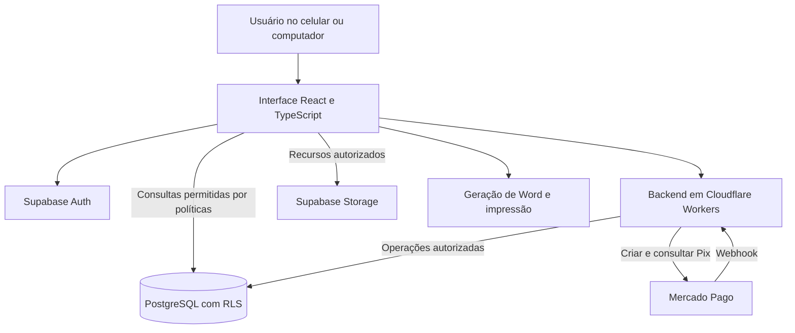
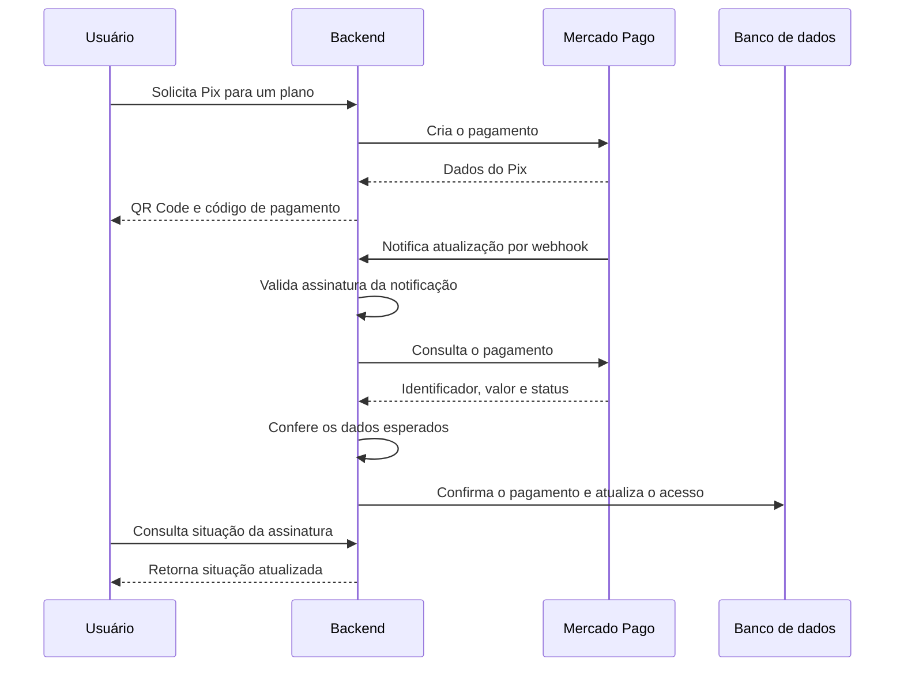

# Arquitetura

[Voltar à apresentação](../README.md)

## Visão geral

O DAIGI combina uma interface React com endpoints executados em Cloudflare Workers. O Supabase fornece autenticação, banco PostgreSQL e armazenamento. A integração com o Mercado Pago fica no backend.

O desenho omite identificadores de infraestrutura, nomes de contas e configurações de produção. Ele representa as responsabilidades dos componentes.

## Separação por empresa

Essa separação se aplica ao fluxo empresarial. O projeto também inclui um editor de acesso livre que mantém os itens em estado local na interface e permite gerar documentos sem acessar o histórico ou os recursos privados de uma empresa.

A identidade autenticada é associada a uma empresa por um vínculo autorizado. Esse vínculo determina o contexto do usuário: configuração visual, catálogo, modelos e orçamentos disponíveis.

As políticas de Row Level Security restringem consultas por empresa. Operações de gravação de orçamentos passam por uma função do banco que verifica vínculo e assinatura. Assim, a seleção visual de uma empresa não é suficiente para conceder acesso aos dados.

Parte da configuração visual e documental ainda está registrada na aplicação, em combinação com os dados do banco. O cadastro integral de novas empresas e seus recursos pelo painel é uma evolução prevista.

## Pagamentos e liberação de acesso

A confirmação financeira é feita no backend. A operação de confirmação no banco trata repetições do mesmo pagamento para evitar que uma notificação duplicada adicione novos dias à assinatura.

O tratamento de reembolso considera o pagamento que iniciou o período vigente, evitando que um reembolso antigo revogue uma renovação posterior. O painel ainda não inicia reembolsos; essa ação é feita no provedor.

## Documentos e histórico

O editor mantém os itens do orçamento e usa preços unitários em centavos. O gerador abre o pacote do modelo Word e altera o XML necessário para inserir os dados, preservando os demais recursos do documento.

O layout de impressão permite usar a função de salvar em PDF do navegador. A leitura de PDFs atende formatos específicos suportados pelo importador; não é um mecanismo universal de reconhecimento de qualquer orçamento.

O histórico organiza os orçamentos por empresa. Reabrir um registro recupera seus itens para continuar a edição.

## Administração

O painel utiliza endpoints protegidos e autorização de administrador no backend. As operações de vínculo de usuários possuem registros de auditoria. A autenticação de um usuário comum não concede acesso administrativo.
